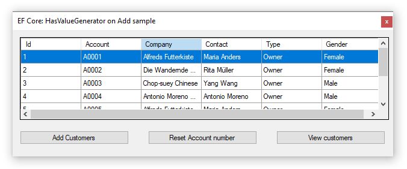

# HasValueGenerator example

A simple example for using Entity Framework Core [HasValueGenerator](https://docs.microsoft.com/en-us/dotnet/api/microsoft.entityframeworkcore.metadata.builders.propertybuilder-1.hasvaluegenerator?view=efcore-3.1) to increment a field value when adding a new record.

[Microsoft TechNet article](https://social.technet.microsoft.com/wiki/contents/articles/53858.entity-framework-core-hasvaluegenerator-c.aspx)

